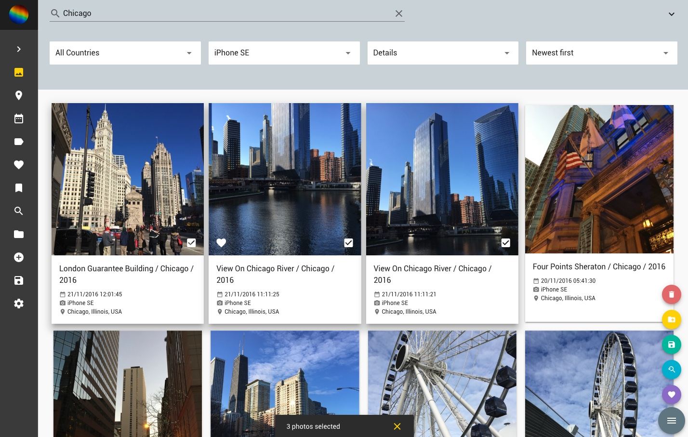

PhotoPrism: Browse your life in pictures
========================================

[][license]
[][donate]
[][code quality]
[][issues]
[][ci]
[][docs]

[license]: https://github.com/photoprism/photoprism/blob/master/LICENSE
[donate]: https://paypal.me/photoprism/10
[code quality]: https://goreportcard.com/report/github.com/photoprism/photoprism
[issues]: https://github.com/photoprism/photoprism/issues
[ci]: https://travis-ci.org/photoprism/photoprism
[docs]: https://docs.photoprism.org/en/latest/

We love taking photos and they belong to our most valuable (and storage consuming) assets. Privacy concerns - and the wish to properly
archive them for the next generation - brought us to the conclusion that existing cloud solutions are not the right tool to keep them organized.
At the same time, traditional desktop software like Adobe Lightroom lacks many features and can only be used on a single computer.
That's why we started working on an easy-to-use application that can be hosted at home or on a private server.



More screenshots: https://photoprism.org/#screenshots

What to expect
--------------

* Clearly structured Web interface for browsing, organizing and sharing your personal photo collection.
* Import everything without worrying about duplicates or RAW to JPEG conversion.
* Reverse geocoding and automated tagging based on Google TensorFlow.
* No monthly costs. No proprietary formats. No privacy concerns.

Installation
------------

This is the official way to test our development snapshot. We just started working on the UI and features are neither complete or stable. Feedback early in development helps saving a lot of time. We're a small team and need to move fast.

Before you start, make sure you got [Docker](https://store.docker.com/search?type=edition&offering=community) installed on your system. It is available for Mac, Linux and Windows.
Developers can skip this and move on to the [Developer Guide](https://github.com/photoprism/photoprism/wiki/Developer-Guide) in our [Wiki](https://github.com/photoprism/photoprism/wiki).

**Step 1:** Download the config file [docker-compose.yml](https://raw.githubusercontent.com/photoprism/photoprism/master/configs/docker-compose.yml) (right click and *Save Link As...*) to a directory of your choice.

By default, a folder named `Photos` in your home directory will be used to store all images. You don't need to create it.

PhotoPrism will also create the following sub-directories in your `Photos` folder: `Import`, `Export` and `Originals`. Copy existing photos to `Import`, not directly to `Originals` as they need to be renamed and indexed in order to remove duplicates.
Files that can not be imported - like videos - will stay in the `Import` directory, nothing gets lost.

If you prefer to use different directory names, you can change them in `docker-compose.yml`. See inline comments for instructions.

**Step 2:** Open a terminal, go to the directory in which you saved the config file and run this command to start the application:

```
docker-compose up -d
```

The Web frontend is now available at http://localhost:2342/. The port can be changed in `docker-compose.yml`. Remember to run `docker-compose restart` every time you touch the config.

**Step 3:** Connect to the application container and run `photoprism import` after putting files in the `Import` folder:

```
docker-compose exec photoprism bash
photoprism import
```

You should now be able to see your photos. You can continue using your favorite tools like Photoshop or Lightroom
to edit images in the `Originals` folder. Run `photoprism index` to reindex them as needed.
Even deleting and adding is possible, if you stick to the naming scheme. Easy, isn't it?

The full documentation can be found on [docs.photoprism.org](https://docs.photoprism.org/en/latest/).

Contribute
----------

If you have a bug or an idea, read the [contributing guidelines](CONTRIBUTING.md) before opening an issue.
Issues labeled `help wanted` or `good first issue` can be good first contributions.

The best way to get in touch is to write an email to hello@photoprism.org or join our [Telegram](https://t.me/joinchat/B8AmeBAUEugGszzuklsj5w) group. We'd love to hear from you!

Donations
---------

Please leave a star if you like this project, it provides enough motivation to keep going.
If you still want to donate, you can do so via [PayPal](https://paypal.me/photoprism/10).
Thank you very much! <3

Sponsoring
----------

Support this project by becoming a sponsor. Your logo will show up on our Web site plus we can help you getting started with any of the technologies we use, either on-site or remote.
