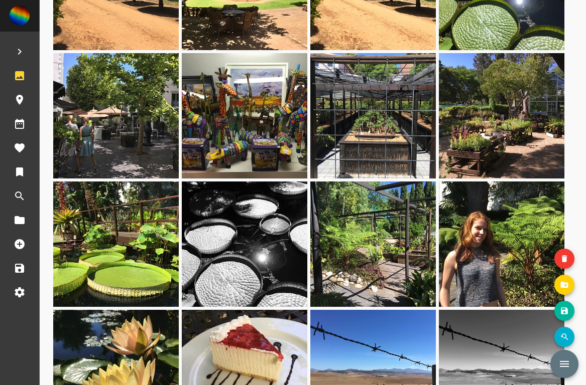

[][powered by]
[][license]
[][code quality]
[][issues]
[][ci]

[powered by]: https://www.tensorflow.org/install/install_go
[license]: https://github.com/photoprism/photoprism/blob/master/LICENSE
[code quality]: https://goreportcard.com/report/github.com/photoprism/photoprism
[issues]: https://github.com/photoprism/photoprism/issues
[ci]: https://travis-ci.org/photoprism/photoprism

PhotoPrism is a server-based application for privately managing large amounts of JPEG and RAW files. It is functionally similar to
popular cloud services such as [Flickr](https://www.flickr.com/) or [Google Photos](https://photos.google.com/).
Originals are stored in the file system in a structured way for easy backup and reliable long-term accessibility.

*Note: This software is still alpha and under active development. You're welcome to join our team.*

Our goal is to provide the following features (tested as a proof-of-concept):
- High-performance command line tool
- [Web frontend](docs/img/search.png)
- No proprietary or binary data formats
- Duplicate detection
- Automated tagging using [Google TensorFlow](https://www.tensorflow.org/install/install_go)
- Text recognition using [Tesseract](https://github.com/otiai10/gosseract)
- [Reverse geocoding](https://wiki.openstreetmap.org/wiki/Nominatim#Reverse_Geocoding) based on latitude and longitude
- Image search with powerful filters
- Easy backup and export

Web Frontend
------------
Open a terminal an type `photoprism start` to start the built-in server. It will listen on port 80 by default.
The UI is based on [Vuetify](https://vuetifyjs.com/en/), a [Material Design](https://material.io/) component framework for Vue.js 2.



Setup
-----
Before you start, make sure you got Git and Docker installed on your system.
Instead of using Docker, you can also setup your own runtime environment
based on the existing Docker configuration (not recommended).

**Step 1:** Run [Git](https://getcomposer.org/) to clone this project:

```
git clone git@github.com:photoprism/photoprism.git
```

**Step 2:** Start [Docker](https://www.docker.com/) containers:

```
cd photoprism
docker-compose up
```

*Note: This docker-compose configuration is for testing and development purposes only.*

**Step 3:** Open a terminal to run tests and commands:

```
docker-compose exec photoprism bash
make
make test
make install
go run cmd/photoprism/photoprism.go start
```

See [Quick and easy guide for migrating to Go 1.11 modules](https://blog.liquidbytes.net/2018/09/quick-and-easy-guide-for-migrating-to-go-1-11-modules/) for an introduction to Go Modules and Makefiles.

Concept
-------


