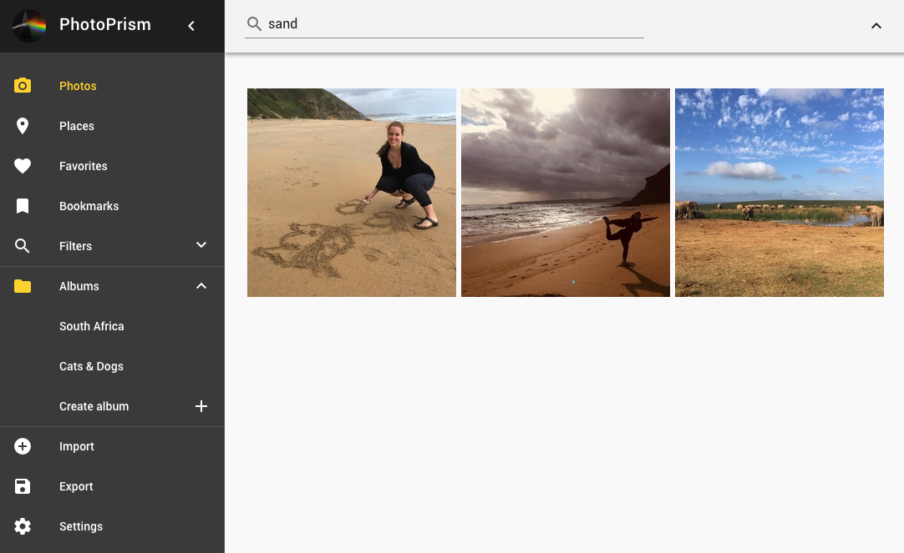

A digital photo library for large amounts of JPEG and RAW files
========================================================================

[][powered by]
[][license]
[][code quality]
[][issues]
[][ci]

[powered by]: https://www.tensorflow.org/install/install_go
[license]: https://github.com/photoprism/photoprism/blob/master/LICENSE
[code quality]: https://goreportcard.com/report/github.com/photoprism/photoprism
[issues]: https://github.com/photoprism/photoprism/issues
[ci]: https://travis-ci.org/photoprism/photoprism

Originals, thumbnails and metadata are stored in the file system for easy
backup and reliable long-term accessibility.

This software is still alpha and under active development. You're welcome to join our team.

Our goal is to provide the following features (tested as a proof-of-concept):

- High-performance command line tool
- Web frontend
- No proprietary or binary data formats
- Duplicate detection
- Automated tagging using Google TensorFlow
- Reverse geocoding based on latitude and longitude
- Image search with powerful filters
- Easy backup and export



Setup
-----
Before you start, make sure you got Git and Docker installed on your system.
Instead of using Docker, you can also setup your own runtime environment
based on the existing Docker configuration.

**Step 1:** Run [Git](https://getcomposer.org/) to clone this project:

```
git clone git@github.com:photoprism/photoprism.git
```

**Step 2:** Start [Docker](https://www.docker.com/) containers:

```
cd photoprism
docker-compose up
```

*Note: This docker-compose configuration is for testing and development purposes only.*

**Step 3:** Open a terminal to run tests and commands (see [Makefile](Makefile)):

```
docker-compose exec photoprism bash
make
make test
make install
go run cmd/photoprism/photoprism.go start
```

This project uses modules and requires Go 1.11 or later. See https://github.com/golang/go/wiki/Modules for more information.

Concept
-------


